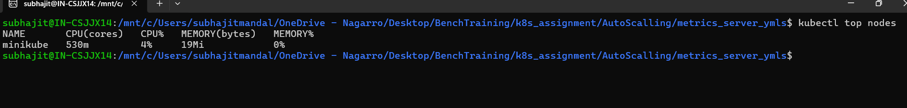
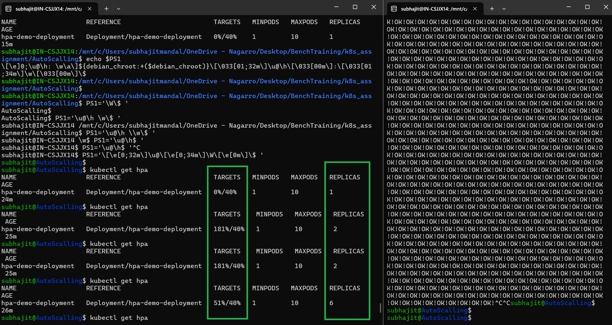

# Horizontal Pod Autoscalling
---

## Dependencies and Assumptions
1. Here Kubernatics official demo HPA example app Image is used to showcase the `Horizontal Pod Autoscaler` 
2. Image: `registry.k8s.io/hpa-example`
3. When the CPU usage will cross the `40%` Mark the new PODs will be replicated
4. Min Pod Count: `1` 
5. Max Pod Count: `10`

## Workflow
1. `app_deploy_and_service.yml` file is to create deployment POD and the Service
2. `HPA.yml` file is to create the Horizontal Pod Autoscaler

## Command to increase load on worker nodes
`$ kubectl run -i --tty load-generator --rm --image=busybox:1.28 --restart=Never -- /bin/sh -c "while sleep 0.01; do wget -q -O- http://hpa-demo-deployment; done"`

## Command to stop load on worker nodes
`$ Ctrl + c`

## Below is the autoscaler Screenshot
* **Metrics server status**

* **Auto Scalling**
