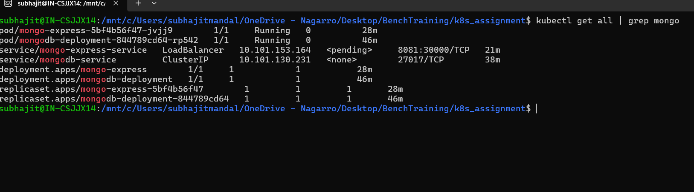

# Docker and Kubernatics Assignment
---

### Deliverables

* Git Repo URL with complete code
* Screenshots of running application along with screenshot of running pods
* Screenshots of autoscalling pods

---

### 1. Github Repo link - https://github.com/subhajit-007/k8s_assignment
---
### 2. Below is the Screenshots of running application along with screenshot of running pods    

##### Assumptions
1. Used mongodb express application image to deploy as Pod 
2. Create a MongoDb Database Pod
3. Create Services to respond to requests from the web browsers as a client
4. Based on the request changes will be reflect in the DB Pod 
5. Create `mongo-secret.yml` file to use sensitive information like DB username and Password

##### Execution Workflow to setup
1. `$ kubectl apply -f mongo-secret.yml`
2. `$ kubectl apply -f mongo-deployment.yml`
3. `$ kubectl apply -f mongo-service.yml`
4. `$ kubectl apply -f mongo-configmap.yml`
5. `$ kubectl apply -f mongo-express.yml`

##### Workflow Image

#### Screenshots
 * **mongodb pod running**

* **All Dependecies for mongo express app**

* **Mongo Express app exposed to web browser**

---
### 3. Below is the Screenshots of autoscalling pods 
   - All the assumption and application details are provided in the following directory: [Directory Link](AutoScalling)
